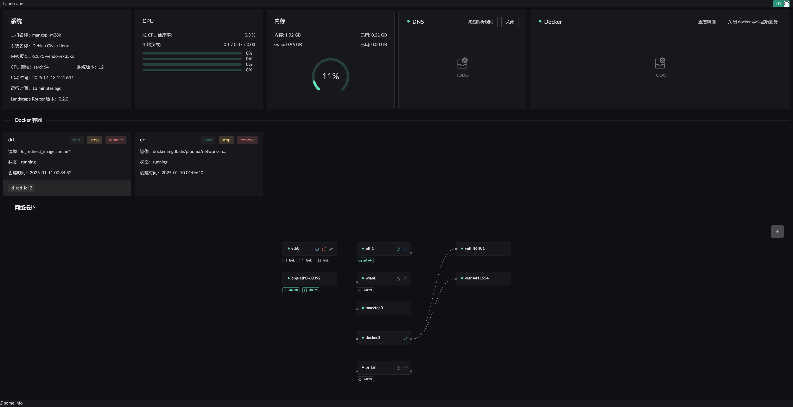

# Landscape - Linux Router Configuration Tool

[](https://www.gnu.org/licenses/gpl-3.0)
[![DeepWiki](https://img.shields.io/badge/DeepWiki-ThisSeanZhang%2Flandscape-blue.svg?logo=data\:image/png;base64,iVBORw0KGgoAAAANSUhEUgAAACwAAAAyCAYAAAAnWDnqAAAAAXNSR0IArs4c6QAAA05JREFUaEPtmUtyEzEQhtWTQyQLHNak2AB7ZnyXZMEjXMGeK/AIi+QuHrMnbChYY7MIh8g01fJoopFb0uhhEqqcbWTp06/uv1saEDv4O3n3dV60RfP947Mm9/SQc0ICFQgzfc4CYZoTPAswgSJCCUJUnAAoRHOAUOcATwbmVLWdGoH//PB8mnKqScAhsD0kYP3j/Yt5LPQe2KvcXmGvRHcDnpxfL2zOYJ1mFwrryWTz0advv1Ut4CJgf5uhDuDj5eUcAUoahrdY/56ebRWeraTjMt/00Sh3UDtjgHtQNHwcRGOC98BJEAEymycmYcWwOprTgcB6VZ5JK5TAJ+fXGLBm3FDAmn6oPPjR4rKCAoJCal2eAiQp2x0vxTPB3ALO2CRkwmDy5WohzBDwSEFKRwPbknEggCPB/imwrycgxX2NzoMCHhPkDwqYMr9tRcP5qNrMZHkVnOjRMWwLCcr8ohBVb1OMjxLwGCvjTikrsBOiA6fNyCrm8V1rP93iVPpwaE+gO0SsWmPiXB+jikdf6SizrT5qKasx5j8ABbHpFTx+vFXp9EnYQmLx02h1QTTrl6eDqxLnGjporxl3NL3agEvXdT0WmEost648sQOYAeJS9Q7bfUVoMGnjo4AZdUMQku50McDcMWcBPvr0SzbTAFDfvJqwLzgxwATnCgnp4wDl6Aa+Ax283gghmj+vj7feE2KBBRMW3FzOpLOADl0Isb5587h/U4gGvkt5v60Z1VLG8BhYjbzRwyQZemwAd6cCR5/XFWLYZRIMpX39AR0tjaGGiGzLVyhse5C9RKC6ai42ppWPKiBagOvaYk8lO7DajerabOZP46Lby5wKjw1HCRx7p9sVMOWGzb/vA1hwiWc6jm3MvQDTogQkiqIhJV0nBQBTU+3okKCFDy9WwferkHjtxib7t3xIUQtHxnIwtx4mpg26/HfwVNVDb4oI9RHmx5WGelRVlrtiw43zboCLaxv46AZeB3IlTkwouebTr1y2NjSpHz68WNFjHvupy3q8TFn3Hos2IAk4Ju5dCo8B3wP7VPr/FGaKiG+T+v+TQqIrOqMTL1VdWV1DdmcbO8KXBz6esmYWYKPwDL5b5FA1a0hwapHiom0r/cKaoqr+27/XcrS5UwSMbQAAAABJRU5ErkJggg==)](https://deepwiki.com/ThisSeanZhang/landscape)

<!-- DeepWiki badge generated by https://deepwiki.ryoppippi.com/ -->

Landscape is a web-based tool that helps you easily configure your favorite Linux distribution as a router.

> Built with Rust / eBPF / AF_PACKET.

[简体中文](./README.zh.md) | [English](./README.md)

## Complete Documentation

For detailed documentation, including installation guides, configuration options,  advanced usage, and so forth, visit our official documentation website:

📖 [Landscape Documentation Website](https://landscape.whileaway.dev/introduction.html) | [Landscape Documentation Repository](https://github.com/ThisSeanZhang/landscape/tree/docs/docs)


---


## Screenshot


---

## Features

> ✅ Implemented and tested
> ⚠ Functional but untested
> ❌ Not implemented

* <u>IP Configuration</u>
  * *Static IP*

    * ✅ Set IP address
    * ✅ Configure default route via gateway
  * *DHCP Client*

    * ✅ Specify hostname
    * ❌ Custom DHCP options
  * *PPPoE (PPPD version)*

    * ✅ Set as default route
    * ⚠ Multi-interface dialing
    * ✅ Specify interface name
  * *PPPoE (eBPF version)*

    * ✅ Protocol core implemented
    * ❌ GRO/GSO causing oversized packets (unsolved)
  * *DHCP Server*

    * ✅ Provide basic IP assignment and renewal
    * ✅ Custom gateway/subnet/access rules
    * ✅ IP-MAC binding
    * ✅ IP lease display
  * *IPv6 Support*

    * ✅ Use DHCPv6-PD to request prefix from upstream
    * ✅ Use RA to advertise prefix to downstream

* <u>Flow Control Module</u>

  * ✅ Tag flows using IP + QoS
  * ✅ Each flow can have its own DNS settings and cache
  * ✅ Route marked traffic based on rules (direct/drop/reuse port/redirect to Docker or NIC)
  * ❌ Assign tracking marks to specified packets
  * ✅ External IP behavior control via tagging and `geoip.dat` support
  * ✅ When IP rules and DNS rules conflict, the priority of the rules is used for verdict (the smaller the value, the higher the priority)

* <u>Geo Management</u>

  * ✅ Manage multiple Geo sources
  * ✅ Auto-update Geo IP/Site data

* <u>DNS</u>

  * ✅ Support DNS over HTTPS and DNS over TLS for upstream
  * ✅ Assign specific upstream DNS by domain
  * ✅ DNS Hijacking (return A records)
  * ❌ Hijack to return multiple records (other than A)
  * ✅ Tag resolved IPs and handle with traffic control
  * ✅ Support GeoSite files
  * ❌ Parse Docker container domain labels into DNS records
  * ✅ Test domain resolution

* <u>NAT (eBPF)</u>

  * ✅ Basic NAT support
  * ⚠ Static mapping / Port forwarding (UI incomplete)
  * ✅ NAT disables port reuse by default; reuse allowed via tagging rules

* <u>Metrics</u>

  * ✅ Report connection stats (bytes/packets) every 5 seconds
  * ✅ Display active connections (not yet combined with NAT)
  * ❌ Open export API for metrics

* <u>Docker</u>

  * ✅ Basic Docker container management and runtime
  * ⚠ Pull images
  * ✅ Route traffic into TProxy-enabled containers

* <u>Wi-Fi</u>

  * ✅ Enable/disable Wi-Fi using `iw`
  * ✅ Create AP with `hostapd`
  * ❌ Connect to existing Wi-Fi hotspot

* <u>Storage</u>

  * ✅ Use database instead of file-based config
  * ✅ Export all current configs as `landscape_init.toml`
  * ❌ UI component to upload/restore config
  * ❌ Config editor via UI
  * ❌ Separate DB path for metrics

* <u>Miscellaneous</u>

  * ✅ Login screen
  * ❌ English UI frontend
  * ✅ NIC XPS/RPS optimization to distribute load across CPU cores

---

## How to Start & Limitations

### System Requirements

* Supported Linux Kernel: `6.9` or later
* (Optional) `docker`

### Manual Startup

1. Create config directory:

   ```bash
   mkdir -p ~/.landscape-router
   ```
2. Download **static.zip** from [release](https://github.com/ThisSeanZhang/landscape/releases) and extract to `~/.landscape-router/static`
3. If you have a desktop environment and browser, you can skip this step.
   Otherwise, refer to [Quick Start Guide](https://landscape.whileaway.dev/quick.html) to create `landscape_init.toml`
4. Start the service by downloading a release binary from [Releases](https://github.com/ThisSeanZhang/landscape/releases)
   Then run (as root):

   ```bash
   ./landscape-webserver
   ```

   Default port: **6300**
   Default username: **root**
   Default password: **root**
   Use `./landscape-webserver --help` for other options.
5. Once everything is confirmed to work, you can set it up as a systemd service.
   Create `/etc/systemd/system/landscape-router.service` with the following content:

   ```text
   [Unit]
   Description=Landscape Router

   [Service]
   ExecStart=/root/landscape-webserver  # remember to modify this path accordingly
   Restart=always
   User=root
   LimitMEMLOCK=infinity

   [Install]
   WantedBy=multi-user.target
   ```

### Docker Compose

See [Quick Start Guide](https://landscape.whileaway.dev/quick.html)

### Armbian Integration

See [Armbian Integration Guide](https://landscape.whileaway.dev/compilation/armbian.html)

---

## Build Instructions

See [Build Documentation](https://landscape.whileaway.dev/compilation/) or [Cross-compilation Guide](https://landscape.whileaway.dev/compilation/cross.html)

---

## LICENSE

* `landscape-ebpf`: [GNU GPL v2.0](https://www.gnu.org/licenses/old-licenses/gpl-2.0.html)
* Other parts: [GNU GPL v3.0](https://www.gnu.org/licenses/gpl-3.0.html)

---

If you have any suggestions or issues, feel free to submit them via [issues](./issues/new).

## Star History

<a href="https://www.star-history.com/#ThisSeanZhang/landscape&Date">
 <picture>
   <source media="(prefers-color-scheme: dark)" srcset="https://api.star-history.com/svg?repos=ThisSeanZhang/landscape&type=Date&theme=dark" />
   <source media="(prefers-color-scheme: light)" srcset="https://api.star-history.com/svg?repos=ThisSeanZhang/landscape&type=Date" />
   
 </picture>
</a>