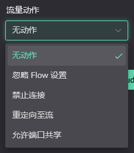

# 分流控制
分流可以`定义`一组目标 IP 行为, `应用`在一组客户端

> 有任何想法欢迎在此发布评论, 或者新建一个也是可以的: https://github.com/ThisSeanZhang/landscape/discussions/88

## 分流概述
* Flow： 一组策略，拥有入口和出口，中文“流”
* 入口： 一组内网客户端, 使用 IP 地址 + QoS 标识进行匹配
* 出口： Docker 容器，之后将会增加多 WAN
* 其他流：Flow 1~255，按入口规则匹配，匹配成功则进入此流
* 默认流：Flow 0，所有未匹配的流量，默认进入此流
* 流内规则匹配方式： 按照优先级，匹配上即发送至出口，后续规则不再进行匹配（只会与一条规则匹配上）

## 流 DNS 设置
* 每一条DNS规则，可以指定上游DNS服务器，或域名重定向
* 每一个Flow，拥有独立的DNS缓存
* 任何Flow，应当至少有一条兜底DNS规则，用于配置上游默认 DNS 服务器  


## 流出口设置

* 默认流出口，在 [Wan 网卡中设置](../other-features/sys-info.md#设置-pppoe-网卡为默认路由添加-pppoe-账号)中，开启 `设置默认路由` 选项即可  
* 其他流出口，在 `流规则编辑` 下方添加 `分流出口规则`  

## src 入口匹配规则设置

### 默认流 Flow 0 入口匹配规则设置
无需设置入口匹配规则，所有未匹配的流量都会进入默认流


### 其他流 Flow 1~255 入口匹配规则设置 
通过侧边栏的 `分流设置` 进入配置，点击 `加号` 添加流  
  
  

## dst 目的匹配规则设置 

### 默认流 Flwo 0 目的匹配规则 设置

通过主页右上方的 `DNS卡片` 进入配置   
  

### 其他流 Flow 1~255 目的匹配规则 设置

通过侧边栏的 `分流设置` 进入配置  
 
 

### dst 目的匹配规则说明 

* 每个流中可添加DNS/IP 规则 共 2^32 条  
* 每个流拥有独立的 DNS 缓存  
* 可通过各流卡片上方的 DNS/目标IP 进行配置专属于该流的配置。 

在 DNS / IP 中的每条规则拥有以下的 `流量动作`. 用于限制`该组`配置中的 `入口流量` 访问规则中的 `目标 IP` 时的动作( 对于DNS是域名查询后得到的地址 ).  


  

> 以下的前提是建立在, 源 IP 匹配上了 该 Flow 的

其中
* 无动作: 标识按照当前的 Flow 出口
* 忽略 Flow 设置: 忽略当前 Flow 指定的出口, 将这个数据包按照默认行为进行处理
* 禁止连接: 丢弃该数据包
* 重定向至流: 使用另一个 Flow 的出口发送这个数据包
<!-- * 允许端口共享: 允许访问此目标的接口被用于 其他IP 进行使用, 在使用 STUN 建立组网时使用. -->

当前 Flow 的流量出口仅有 Docker 容器 (容器中的程序需要与[接应程序](#接应程序镜像)配合使用), 当前还不支持 `多WAN` 作为流的出口.

<!-- # 多个 Flow 组合
当流量进入容器后, 假设流量变为该 容器的 IP 进行发送, 那么可以新建一个 Flow 配置, 将该容器 IP 加入, 这样就能控制该容器发出流量的行为.
( 大多数情况应该属于多此一举 ) -->
## Docker 容器作为流出口

* 仅有由[装有 **接应程序** 的镜像](https://github.com/ThisSeanZhang/landscape/pkgs/container/landscape-edge)启动的容器，可作为有效的流出口容器  
* 可挂载任意程序在`/app/server` 目录下作为 **工作程序**
* 可挂载 `/app/server/run.sh` 脚本用于启动 **工作程序**  
* **工作程序** 需监听 `12345` 端口作为tproxy入口  
* **接应程序** 将待处理流量转发到 **工作程序** 的tproxy入口 
* 通过环境变量 `LAND_PROXY_SERVER_PORT` 可修改 **接应程序** 之目的端口（默认 `12345` ）  

### 接应程序（镜像）
项目提供了一个 **测试接应程序** 以便进行测试, [装有 **接应程序** 的镜像在此](https://github.com/ThisSeanZhang/landscape/pkgs/container/landscape-edge):

如果使用 UI 上的镜像运行界面运行, 记得点击按钮, 将会添加一个 label. (手动添加一个也可以, 后台运行时会自动添加,下方手动运行需要的设置)


进行启动可以忽略, 如果使用第三方或者手动启动则需要注意添加以下参数:
* docker run
```shell
docker run -d \
  --name your_service \
  --sysctl net.ipv4.conf.lo.accept_local=1 \
  --cap-add=NET_ADMIN \
  --cap-add=BPF \
  --cap-add=PERFMON \
  --privileged \
  -v /root/.landscape-router/unix_link/:/ld_unix_link/:ro \ # 必要映射
  # 可挂载 任意工作程序及其启动脚本等所需文件
  ghcr.io/thisseanzhang/landscape-edge:amd64-xx # xx需修改为合适版本
```

* compose
```yaml
services:
  your_service:
    image: ghcr.io/thisseanzhang/landscape-edge:amd64-xx # xx需修改为合适版本
    sysctls:
      - net.ipv4.conf.lo.accept_local=1
    cap_add:
      - NET_ADMIN
      - BPF
      - PERFMON
    privileged: true
    volumes:
      - /root/.landscape-router/unix_link/:/ld_unix_link/:ro # 必要映射
      # 可挂载 任意工作程序及其启动脚本等所需文件
```
默认设置下， 容器有一个[**演示工作程序** ](https://github.com/ThisSeanZhang/landscape/blob/main/landscape-ebpf/src/bin/redirect_demo_server.rs) 放置在 `/app/server` 监听 `12345` 端口作为tproxy入口。

而 **接应程序** 是放置在 `/app`， 默认情况下是会将待处理流量转发到，演示 **工作程序** 监听端口 `12345`的tproxy入口。 可以通过设置容器的环境变量改变监听端口: `LAND_PROXY_SERVER_PORT`。

可将需要的 **工作程序** 挂载在 `/app/server` 目录下以替换 **演示工作程序**，将 **工作程序** 启动脚本挂载为 `/app/server/run.sh` ， `/app/start.sh` 默认会去执行`/app/server/run.sh`以启动 **工作程序** 或 **演示工作程序** 。


### /app/start.sh 文件（非 **工作程序** 启动脚本）

**[测试接应程序镜像](https://github.com/ThisSeanZhang/landscape/pkgs/container/landscape-edge)中已包含，无需自行添加/挂载**

```bash
#!/bin/bash

ip rule add fwmark 0x1/0x1 lookup 100
ip route add local default dev lo table 100

/app/server/run.sh /app/server &
/app/redirect_pkg_handler &

wait
```
## 分流在代码中的流程示意图:


